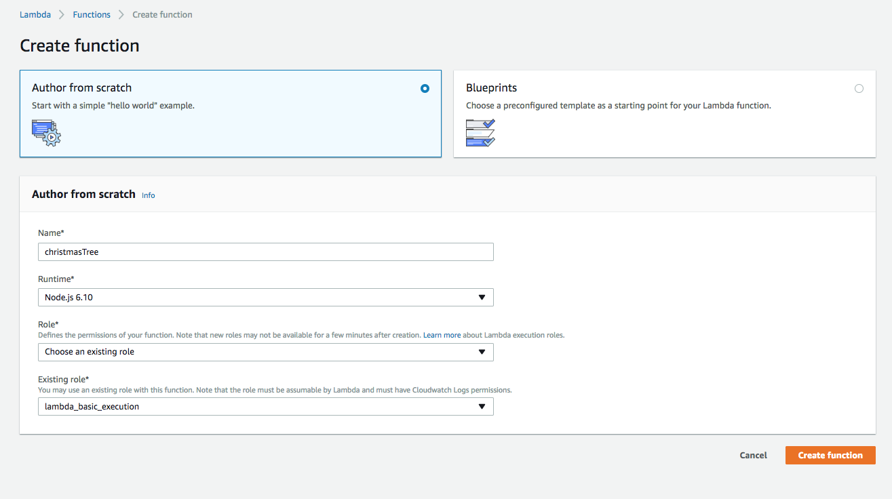
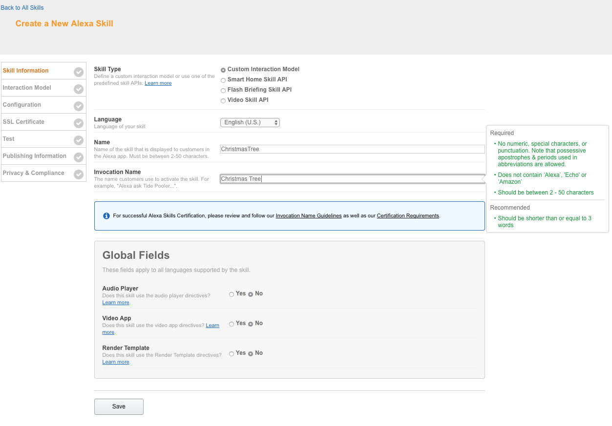
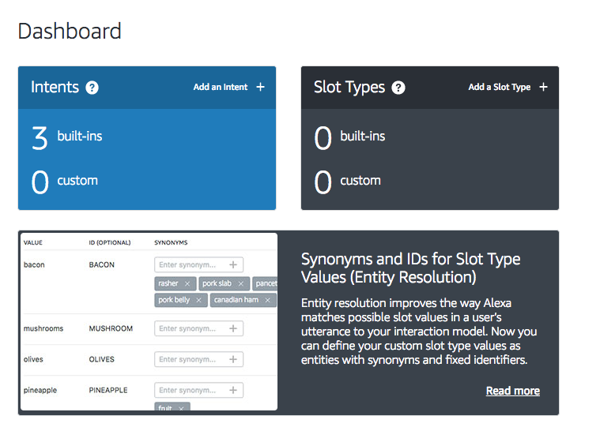

This year for the holiday season, I decided to try to hook up the Christmas tree to Alexa. I drew inspiration from [Jeff Sacks'](https://twitter.com/jeff_sacks) awesome RubyConf talk, [Voice Controlled Home Automation in Ruby](https://www.youtube.com/watch?v=UaoL8x-brO8), in which he showed how to hook up Alexa to his TV and TiVO.

## The Goal

I opted for a much more modest goal than Jeff's - I just wanted to turn my Christmas tree on and off with Alexa. I originally thought about trying to have Alexa enable "christmas mode", which would turn on some music, kill all the lights, light the fireplace, and turn on the tree for a grand finale. I decided on a much more modest goal, and hopefully also avoided burning down the entire building.

## Materials

1. [IoT Relay](http://amzn.to/2iadgl8) - \$30
2. [Electric Imp - April Breakout board](http://amzn.to/2ApXgnw) - \$24
3. [Electric Imp card](http://amzn.to/2npoFTs) - \$50
4. [a breadboard](http://amzn.to/2nmpPPL) - \$7

Luckily I already had all this stuff laying around from older projects.

## Plan

I wanted to use as much IoT hardware that I already had, so the setup needed to be pretty simple. I also wanted the whole thing to be serverless, so Amazon Lambda functions seemed like a good tool.

Turning on the Christmas lights was on and off was pretty simple. I had an [IoT Power Relay](http://amzn.to/2iadgl8) laying around. This device lets you control a power outlet with a Raspberry Pi, Arduino, or other Microprocessor. I used an [Electric Imp](http://amzn.to/2Aqroiz) because I had one that my friend gave me a while back. (Thanks [Ali](https://twitter.com/h0ngbird)!) The Imp is great because it has a web interface that you can hit with GET requests.

So, the plan looks like this:

1. Plug the lights into the IoT Relay.
2. Use the Electric Imp to turn the power on/off on the relay.
3. Use a Lambda function to control the Electric Imp
4. Make an Alexa skill to run the Lambda function

This is ideal for several reasons. First, the Imp has its own web server, so I don't have to host any code. Second, I don't need to open up ports on my router to the public internet. Jeff solved this problem by using Amazon SQS. Basically, his Lambda function would put a message on a queue, and then his local webserver would poll the Queue for messages every second or so. Kudos to Jeff for such a clever solution! I think our setup will be a bit simpler, thanks to the Imp's web server!

## Let's do it!

Ok let's write the code for the Electric Imp. We need Agent code (the code that lives on the Electric Imp web server), and the Device code (the code that the Imp runs).

```js
function requestHandler(request, response) {
    try {
        // Check if the user sent power as a query parameter
        if ("power" in request.query) {
            // If we got the power
            if (request.query.power == "1" || request.query.power == "0") {
                // Convert the power query parameter to an integer
                local powerState = request.query.power.tointeger();

                // Send "setPower" message to device, and send powerState as the data
                device.send("setPower", powerState);
            }
        }
        // Send a response back to the browser saying everything was OK.
        response.send(200, "OK cool");
    } catch (ex) {
        response.send(500, "Internal Server Error: " + ex);
    }
}

// Register the HTTP handler to begin watching for HTTP requests
http.onrequest(requestHandler);
```

And the device code:

```
// Device code (the Elctric imp runs this)
// 1. create a variable for the output pin
relay <- hardware.pin9
// 2. Set the pin to 0
relay.configure(DIGITAL_OUT, 0)
function setPowerState(state) {
  server.log("Turning power on/off: " + state)
  relay.write(state)
}
// Register a handler for incoming messages from the Imp agent
agent.on("setPower", setPowerState)
```

## Wire up the Imp

Plug your Electric Imp into the breadboard. Connect one end of the jumper wire to pin 9 on the Imp, and other end into the (+) side of the relay. Use another jumper between the Imp's ground pin and the (-) side of the relay.

That's it!

Now that we have the Electric Imp plugged in, lets test it out. We can hit the Electric Imp server with curl:

```bash
curl -i "https://agent.electricimp.com/**************?power=1"
```

The response should look like this.

```bash
HTTP/1.1 200 OK
Date: Tue, 05 Dec 2017 19:03:35 GMT
Server: nginx/1.4.6 (Ubuntu)
Content-Length: 7
Connection: keep-alive

OK cool
```

Great! It works just as expected. Next, let's create a Lambda function to do the same thing.

## Creating an AWS Lambda Function

[Log into the AWS Lambda dashboard.](https://console.aws.amazon.com/lambda/home) and click on _Create function_

Fill out the form like this - we want to author it from scratch, we want the Node.js 6.10 runtime, and a basic role for lambda execution. If you don't have the role yet, set it up now.



the starter code looks like this:

```js
exports.handler = (event, context, callback) => {
  // TODO implement
  callback(null, "Hello from Lambda")
}
```

We need it to make a single web request, so it won't need to be much more complicated than that. Paste this in there:

```js
var http = require("http")
let baseUrl = "http://agent.electricimp.com/XiXAucUdTaAa?power="

function turnItOn() {
  let url = baseUrl + "1"
  sendRequest(url)
}

function turnItOff() {
  let url = baseUrl + "0"
  sendRequest(url)
}

function sendRequest(url) {
  http
    .get(url, res => {
      console.log("Got response: " + res.statusCode)
    })
    .on("error", e => {
      console.log("Got an error: " + e.message)
    })
}

exports.handler = (event, context, callback) => {
  try {
    let intentName = event["request"]["intent"]["name"]
    intentName == "TreeOnIntent" ? turnItOn() : turnItOff()
  } catch (e) {
    turnItOn() // lets turn on the tree, just in case
  }

  let response = {
    version: "1.0",
    response: {
      outputSpeech: {
        type: "PlainText",
        text: "ok",
        ssml: "<speak>ok</speak>",
      },
    },
  }
  callback(null, response)
}
```

## Making a Custom Alexa Skill

Lets dive right in.

1. Go here: [https://developer.amazon.com/alexa](https://developer.amazon.com/alexa)
2. Click **Get started** under Alexa Skills kit
3. Click **Add a new skill**
4. Choose an invocation name. I went with Christmas tree. 

This part was tricky at first. I wanted to be able to say **Alexa, turn on the tree**, but the phrase **turn on...** tells Alexa to look for a Smart Home Skill API. That's a little more complicated to set up, because you have to register your Smart Device and authenticate it. Let's avoid that for now.

Since we need to stick to custom skill invocations, we need to pick something along these lines:

```markdown
Alexa, _ask_ christmas tree to light up
Alexa, _ask_ christmas tree off/on
Alexa, _tell_ christmas tree to light up
Alexa, _load_ christmas tree and turn it on
Alexa, _run_ christmas tree and turn on the lights
Alexa, _start_ christmas tree on
```

Some of these are a little clunky, but they'll do the trick. (Let me know if you have better ways of solving this!)

[Here's a good doc from Amazon that thoroughly explains all of the invocation details.](https://developer.amazon.com/docs/custom-skills/understanding-how-users-invoke-custom-skills.html)

Next up, we define the interaction model. Amazon has a new Skill Builder with a slick UI in Beta that I really enjoyed using. Click on **Launch Skill Builder (BETA)**


Lets start by making a new Intent.


We will need two Intents - one to turn the tree on, and another to turn it off.


I named them _TreeOnIntent_ and _TreeOffIntent_. After we name the intent, we need to add _utterances_. These are the things that come after the invocation name when someone is speaking to Alexa. **After you do this, make sure your Lambda function code has the correct intent names**.

The whole command breaks down like this:

**`Alexa, ask|tell|load|run|start <invocation name> <utterance>`**

For the _TreeOnIntent_, I used these utterances:

```bash
on
tree on
light the tree
lights on
christmas tree on
light it up
```

Make sure you add a **TreeOffIntent**, and write down some utterances that are the opposite of what you had for the **TreeOnIntent**. Next, click **Save Model** and then **Build Model** in the top menu. This step can take a few minutes. Once it's done, click on **Configuration** in the top menu bar. Now we're back out in the configuration wizard. This is where we hook up the Lamdba function. Go back to the page where you created your Lambda function and find the ARN in the top right corner.

It will look like this: **arn:aws:lambda:us-east-1:12345678987:function:christmasTree**

Before we hit Next, we need to set up the event source type for our Lambda function. Keep this page open, and go back to the same AWS Lambda page where you found the ARN and click on Alexa Skills Kit from the list of Triggers.

Once you click ont the Alexa Skills Kit, go down to the **Configure Triggers** section and click **add**. Save your function and then head back to the Configuration tab of the Alexa Skill wizard. You should now be able to hit Save and Next.

### Testing your Alexa Skill

This is where we test the utterances. Try typing any of the utternaces in the Service Simulator.

If it looks like this and your tree turned on, it works!!


Your skill should automatically be enabled in your Alexa account, but you can go check it out by logging into your account at [here](https://alexa.amazon.com/spa/index.html).

And that's all there is to it!

Have you worked on any cool home automation projects? I would love to hear about them - let me know on [twitter](https://twitter.com/prazgaitis)!
