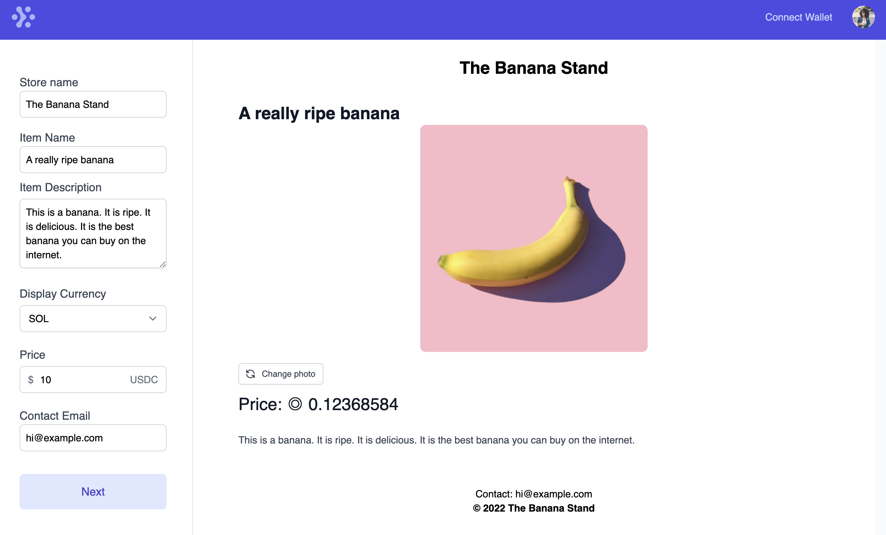

## Side project? Or a one-way ticket to prison

A couple of ago I stumbled upon a project that was intriguing because it was so simple. It's called [onetem.store](https://oneitem.store).

It's an online store builder, but that's not what makes it interesting. There are hundreds of those, but this one is cool because of what it _doesn't_ do. There's no inventory, no shipping tracker, no pop-ups. [The creator built it in about a week](https://tinyprojects.dev/projects/one_item_store) and then sold it for a couple thousand bucks. Not bad!

I recently [wrote a summary](/the-state-of-crypto-payments) of the current state of crypto payments, and it gave me an idea.

Could we do a one-item store, but with completely free payments? Is it possible to sell stuff online without the 3% tax to Stripe? Disclaimer: I think Stripe is great. I use them professionally and I love the product and the folks who build it. It's well worth the 3-ish percent fee.

A bit of background. My day job is at <a href="https://www.cameo.com/praz" target="_blank">Cameo.com</a>, where I'm the Tech lead of the Payments team. We do regular Web2 marketplace-style payments, but recently we've also taken the plunge into Web3 with the release of [CameoPass](https://pass.cameo.com). We have a few more crypto-related projects in the pipeline - stay tuned!

Anyway, back to the store.

This project might end with me sitting in a jail cell, but we'll get to that in a bit. As it turns out, yes. It actually _is_ possible to build a really simple store that lets you sell stuff for free.

It's a bit like Stripe. It's similar to Shopify. It's actually just a clone of _one item store_, but powered by crypto. I call it....

### ... Stropify ⚡

Yes, I know. The name is horrible. But the domain was available and I thought it was kinda funny. If you think of a better name, please <a href="https://twitter.com/prazgaitis" target="_blank">let me know</a> and we can change it.

Either way, check it out here: <a href="https://stropify.xyz" target="_blank">stropify.xyz</a>

### How does it work?

Head over to the page and take a look at the example stores. There's a <a href="https://www.stropify.xyz/store/the-banana-store" target="_blank">Banana Store</a>, where you can buy an actual banana for $10 USDC. Yes, if you buy it, I will actually mail you a banana (US addresses only, please).

Maybe you want to sell something too? A physical item? An e-book? Create a store, connect your [Phantom Wallet](https://phantom.app), and start selling!

When someone buys something, you will receive the funds in your wallet thanks to [Solana Pay](https://solana.com/news/solana-pay-announcement). I don't take a cut on the transaction - you keep 100% of the proceeds. The buyer will pay a few fractions of a penny to send the payment.

### Why should I care?

You could do a few cool things here. First off, you can sign up and log in just by linking your Phantom wallet - no email needed.

You can price your products in USDC, Solana, Ether, or Bitcoin. Tell me - which one of these looks more expensive?

180 SOL             |  $18,000 USD
:-------------------------:|:-------------------------:
 |  

They're the same price!

There's a prevailing theory that people will spend $300K on a monkey jpeg because 100 ETH _looks_ like a lot less money than *$300,000.00 💵 United States Dollars* 💵.

Put this theory to the test. Try to something pricey and see if anyone buys it.

Maybe you use Gumroad to sell a PDF or a course? Are you tired of paying [9% fees](https://gumroad.com/pricing)? Try selling it here instead.

### Roadmap

The idea with this project was to add just a tiny bit of Web3 into a dead-simple (and frankly unimpressive) "Web2" project. 

Not everything needs to be on the blockchain. In fact, most things _shouldn't_ be on the blockchain - it's a terribly slow (except Solana 😎), inefficient database. However, the things that it does -- censorship resistance, immutability, security, decentralization -- it does very well.

This little project could go a lot of ways. For one, I could end up in jail for putting bananas in the mail. Second, this is kinda like a Silkroad-lite, and we all know what [happened to that guy](https://www.investopedia.com/tech/ross-ulbricht-dark-net-pirate/). Please don't sell illegal stuff here 🙏.

Aside from that, there are some cool things here. For example, if someone buys something from _any_ of the stores on Stropify with a wallet, you can enable 1-click checkout across the whole network.

It would also be interesting to let merchants give buyers an NFT after a purchase. This could enable a sort of loyalty or rewards program.

It would be cool to add on-chain verified reviews. I'd like to add the ability to pay with ETH and Bitcoin Lighning. [Let me know](https://twitter.com/prazgaitis) if you have tips on how to do it!

### Pricing

Right now the whole thing is free. The only thing that costs anything is when the buyer pays a Solana transaction fee, which is effectively free.

The main goal here was to get my hands dirty with Web3, not to make any money. However, there are a few ways to monetize this thing.

If I charge a 1% payment processing fee, that's still much less than a merchant would pay anywhere else with regular online payments. [Coinbase Commerce](https://commerce.coinbase.com/) and [BitPay](https://bitpay.com/pricing) also charge 1%. Gumroad, as mentioned above, starts out with a 9% transaction fee.

Shopify charges a monthly fee, so that could be an option too.

Another option is offering some sort of escrow service for larger transactions. There are also upsell opportunities -- give merchants the ability to sell multiple products, multiple photos per product, custom domains, memberships, digital downloads, etc. The opportunities are endless!

Let me know what you think, and if you have something to sell, go for it!
